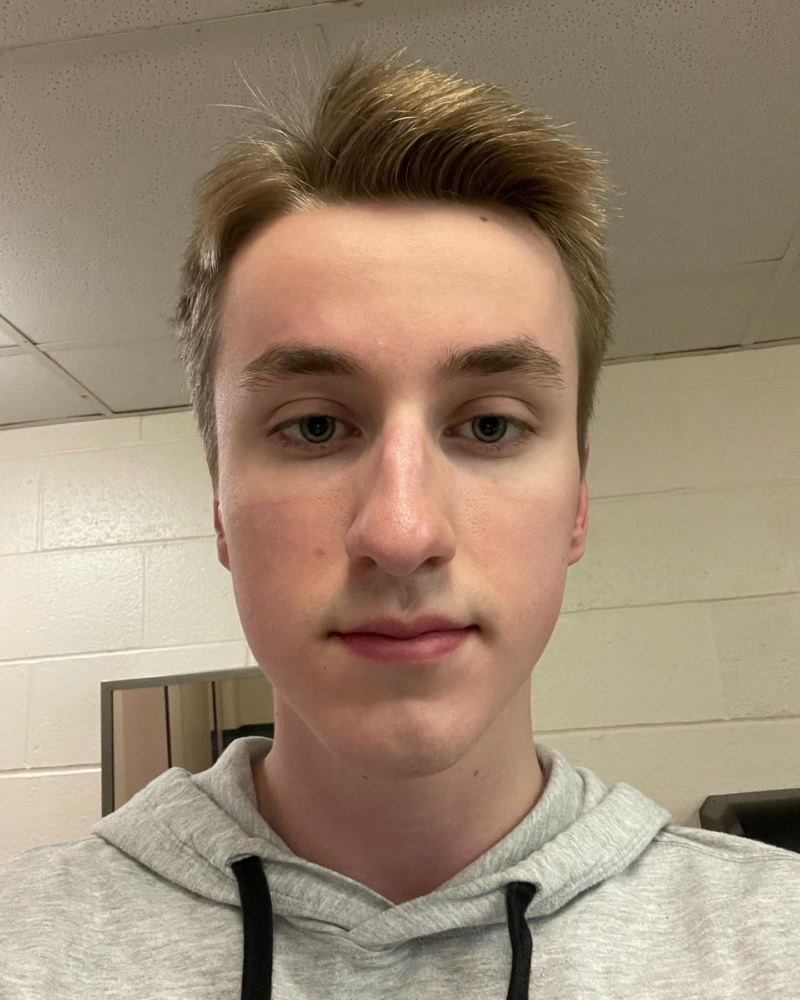

# About
My name is Andrew Labbe and I am a freshman at Quinnipiac university. I am currently enrolled in their 4-year Bachelor's of science degree in computer science. I like to play tennis, videogames and hang out with friends in my spare time. If I could live anywhere in the world, Massachusetts is probably my number 1 choice (next to New Hampshire).

## When I developed my love for programming
When I was around 8 years old, my elementary school had these nights called "Minecraft Mondays." Every Monday night, kids in my school would come with their parents to code Minecraft simulations in block style, similar to app inventor. My first time doing this sparked my love for computers and coding, I begged my mom to sign me up for the local IT coding program that summer.

## Experience
Since then, I have been coding for around 7-8 total. I have worked with many languages, such as C++, C#, JavaScript, HTML, Java, Scala and Python. I am most knowledgeable in Java with Scala and C# in close second. Concerning work experience, I worked 6 months at the Rocky Hill CT McDonald's, 5 years in private landscaping and 2 months in the Rocky Hill Jersey Mikes.

## [Back to Homepage](https://andrewlabbe.github.io)
